<h1>Data Science Project</h1>

<h2>Table of Contents</h2>

- [Installation](#installation)
- [Getting the Data](#getting-the-data)
  - [Usage to extract Data from the API](#usage-to-extract-data-from-the-api)
- [A first glance at the data](#a-first-glance-at-the-data)
- [Problems that occurred](#problems-that-occurred)
- [A day in the life of a Sprottenflotte station](#a-day-in-the-life-of-a-sprottenflotte-station)
  - [The data](#the-data)
  - [Visualize the average day per station and the average day of all stations](#visualize-the-average-day-per-station-and-the-average-day-of-all-stations)
  - [Apply Amplitude Scaling to the plots](#apply-amplitude-scaling-to-the-plots)
  - [Calculate global extreme values](#calculate-global-extreme-values)
  - [Calculate the gradients for each hour](#calculate-the-gradients-for-each-hour)
  - [Outlier Detection and Visualization](#outlier-detection-and-visualization)
- [Do stations have similar patterns?](#do-stations-have-similar-patterns)
  - [Attributes of the stations](#attributes-of-the-stations)
  - [The data](#the-data-1)
  - [Clustering](#clustering)
    - [Preproccesing the dataframe](#preproccesing-the-dataframe)
    - [Finding the optimal number of clusters](#finding-the-optimal-number-of-clusters)
    - [k-means clustering](#k-means-clustering)
    - [PCA](#pca)
  - [Location of stations](#location-of-stations)
- [Most common routes](#most-common-routes)
  - [What stations should be used?](#what-stations-should-be-used)
  - [Getting the most common routes](#getting-the-most-common-routes)
    - [Preparing the data](#preparing-the-data)
    - [Get the routes](#get-the-routes)
    - [Get most common routes](#get-most-common-routes)
  - [Visualizing the routes](#visualizing-the-routes)
  - [Page Rank](#page-rank)
- [Weather and Sprottenflotte](#weather-and-sprottenflotte)
  - [Preprocessing weather data](#preprocessing-weather-data)
  - [Preprocessing Sprottenflotte data](#preprocessing-sprottenflotte-data)
    - [Filter for interesting time slots](#filter-for-interesting-time-slots)
    - [Aggregate to half hours](#aggregate-to-half-hours)
  - [Weather and Sprottenflotte together](#weather-and-sprottenflotte-together)
    - [A first glance at the combined data](#a-first-glance-at-the-combined-data)
    - [Clustering on the data](#clustering-on-the-data)
  - [Predictions](#predictions)
    - [Predictions over all stations](#predictions-over-all-stations)
      - [Linear regression](#linear-regression)
      - [Classification](#classification)
    - [Predictions for each station](#predictions-for-each-station)
  - [Conlusions and Outlook](#conlusions-and-outlook)
- [Web Application](#web-application)

## Installation

To use any of our code or examples, first install the requirements. This can be done by

```
pip install -r requirements.txt
```

We use [Pandas](https://pandas.pydata.org/) to work with the csv-files and export them to dataframe. The [requests](https://pypi.org/project/requests/) module was used to request the API. To visualize the output we mainly use [Matplotlib](https://matplotlib.org/),[seaborn](https://seaborn.pydata.org/) and [Plotly](https://plotly.com/). For the Clustering-Algorithm we use [scikit-learn](https://scikit-learn.org).
For the visualization on the map we use [ipywidgets](https://ipyleaflet.readthedocs.io/en/latest/), [ipyleaflet](https://ipywidgets.readthedocs.io/en/stable/) and also [OpenStreetMap](https://www.openstreetmap.de/).

## Getting the Data

We used the [donkey API](https://github.com/DonkeyRepublic/donkey_gbfs/blob/master/systems.csv) to get the stations of bikes in Kiel and the corresponding usage of the bikes.
Also we used the [Brightsky API](https://brightsky.dev/) to receive weather data of Kiel. The API uses the data of the Deutscher Wetter Dienst.

### Usage to extract Data from the API

To use the [sprottenflotte_data.py](https://git.informatik.uni-kiel.de/stu217750/data-science-projekt/-/blob/main/scripts_data_collection/sprottenflotte_data.py) script you need to specify the API address as a string and the filename of the saved csv-file:

```
python sprottenflotte_data.py <api_addresss> <file_name>
```

This will create a folder /results, if not existing, and the csv-file will be saved in the directory. The output will look like this:

```
Station_ID  Number_of_Bikes Number_of_Docks_Available   is_installed    is_renting  is_returning    last_reported   last_update
24371       23              78                          1               1           1               1677792158      1677802253
24464       18              23                          1               1           1               1677781956      1677802253
24384       0               40                          1               1           1               1677777220      1677802253
24424       17              23                          1               1           1               1677795538      1677802253
...
```

To use the [weather_data.py](https://git.informatik.uni-kiel.de/stu217750/data-science-projekt/-/blob/main/scripts_data_collection/weather_data.py) script you need to specify the API address as a string and the filename of the saved csv-file:

```
python weather_data.py <api_address> <file_name>
```

This will create a folder /results, if not existing, and the csv-file will be saved in the directory. The output will look like this:

```
cloud_cover Condition   Precipitation   relative_humidity   Visibility  wind_direction  wind_speed  wind_gust_speed Sunshine    Temperature Station         timestamp
88          dry         0.0             98                  3461        280             9.7         10.4            0.0         0.4         Kiel-Holtenau   2023-03-03T00:00:00+00:00
0           dry         0.0             99                  1651        280             8.3         9.4             0.0         0.4         Kiel-Holtenau   2023-03-03T00:30:00+00:00
0           fog         0.0             99                  642         290             10.1        11.2            0.0         -0.4        Kiel-Holtenau   2023-03-03T01:00:00+00:00
0           fog         0.0             99                  867         290             10.4        12.6            0.0         -0.8        Kiel-Holtenau   2023-03-03T01:30:00+00:00

```

## A first glance at the data

The following maps have been generated in the jupyter notebook [map.ipynb](map.ipynb).

The first glance at the data revealed that there is even one station in Estonia.

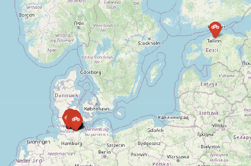

A closer look showed that there are several stations around Kiel in the data.

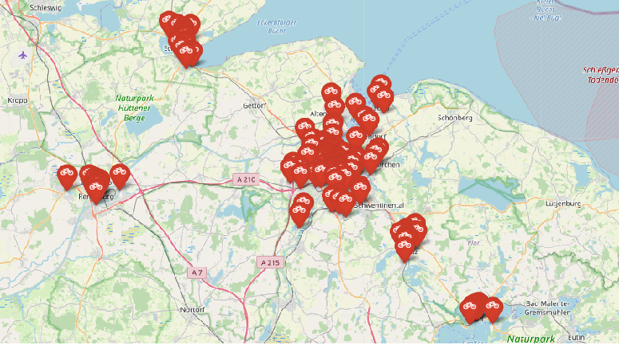

From there on we only looked at the stations in Kiel as it is very unlikely that someone takes a rental bike out of Kiel or the other way around.

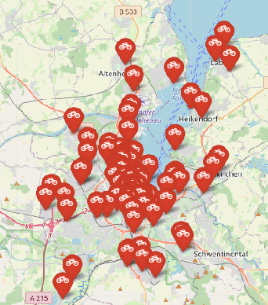

## Problems that occurred

After about a week of collecting the data, a new bike station "Cruise Center Kiel / Fahrrad Messe Popup" showed up in Kiel. As the name suggests, this is just a temporary station around the "Fahrradmesse" on March 12th. However, this created some problems in our data since the station has not been around right from the beginning of our data collection. We could resolve this issue by adjusting some of our functions handling the data, but it was not an easy fix.
Regarding the weather data a lot of preprocessing was necessairy. Due to some gaps during the data collection time there was some noise in the data and it was not easy to process the two data sets to bring them in the same format. Additionally the two data sets were collected in two different time format and time intervals.
At last you can say for all of the processings we did- but especially for the predictions and classifications- we had way too few data to let the results be significant. But our results are probably a very good start point for more analysis.

## A day in the life of a Sprottenflotte station

The overall question of this section is, if one could see a pattern of Sprottenflotte usage over a whole day and whether there are stations that behave differently to this pattern.
The respective calculations have been done in the jupyter notebook [daily_usage.ipynb](daily_usage.ipynb).

### The data

In order to address this question, we collect the data from all the stations in Kiel.
At first the data looks like the following:

```
  Station_ID  Number_of_Bikes Number_of_Docks_Available is_installed  is_renting  is_returning	last_reported   last_update
0 24371       23              78                        1             1           1             1677792158      1677802253
1 24464       18              23                        1             1           1           	1677781956      1677802253
2 24384       0               40                        1             1           1           	1677777220      1677802253
3 24424       17              23                      	1             1           1           	1677795538      1677802253
4 24468       2               17                      	1             1           1           	1677687849      1677802253
```

After converting the data, it looks like this, where 'last_update' is the timestamp at which we requested the data and 'last_reported' is the last time, that the station has been used (a bike was rented or returned at this station):

```
  Station_ID  Number_of_Bikes last_update             last_reported
0 24371       23              2023-03-03 00:10:53     1677792158
1 24464       18              2023-03-03 00:10:53     1677781956
2 24384       0               2023-03-03 00:10:53     1677777220
3 24424       17              2023-03-03 00:10:53     1677795538
4 24468       2               2023-03-03 00:10:53     1677687849
```

### Visualize the average day per station and the average day of all stations

We can now compare the usage behaviour by filtering the number of changes of 'last_reported' for every station and every hour (the latter via 'last_update') over all days. This way we can plot the usage behaviour for every station and even the overall average of all stations for an average day.
After normalizing that data, it looked like the following:

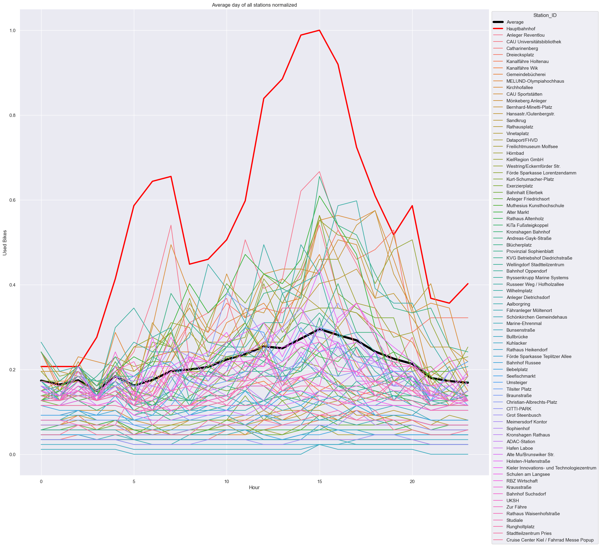

It clearly shows that the central station in Kiel is by far being used the most.
Additionaly most stations seem to have their peak usage in the afternoon with a very low usage at night.
We now want to convince you that you shouldn't consider the central station as an outlier right away by looking at some characteristics of the different plots.

### Apply Amplitude Scaling to the plots

As a next step we apply amplitude scaling to the plots in order to compare the different patterns of usage more concisely.
Therefore we use the following formula taught by the Data Science lecture: $x_i = (x_i - mean(x)) / std(x)$ for a time series $x$.
If you now take a look at the central station, you can see that it behaves quite similar to the "average station":

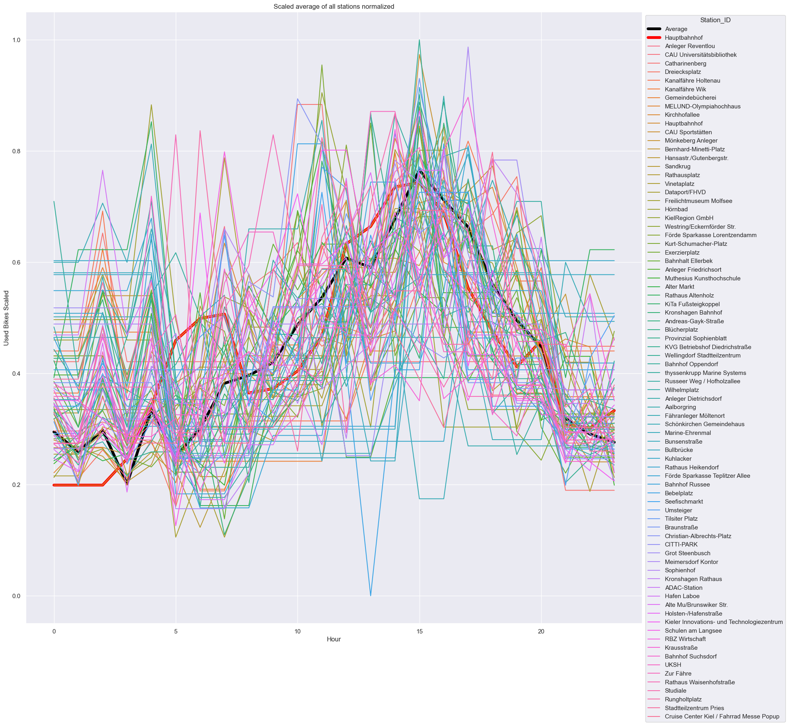

### Calculate global extreme values

An additional factor to compare the different stations is to look at the global minimum and maximum of each plot.
We will use these values later for our outlier detection.
You can see them plotted in the following graph:

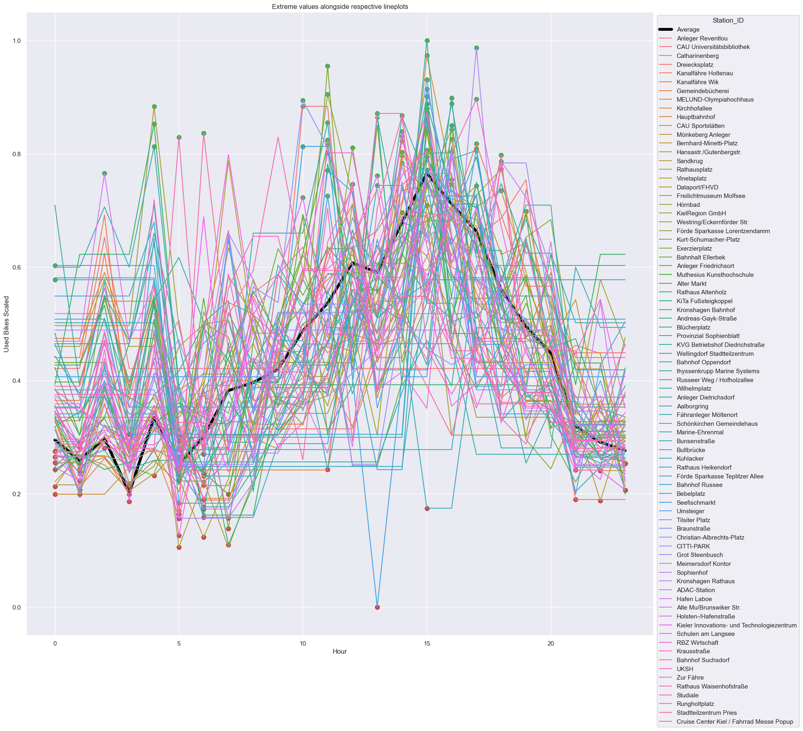

### Calculate the gradients for each hour

In order to compare the different plots, we also take a look at the gradients for each hour, which you can see in the following graph.
They also display the course of each plot (most gradients are positive until the afternoon, then they tend to become negative as the usage of bikes is decreasing).

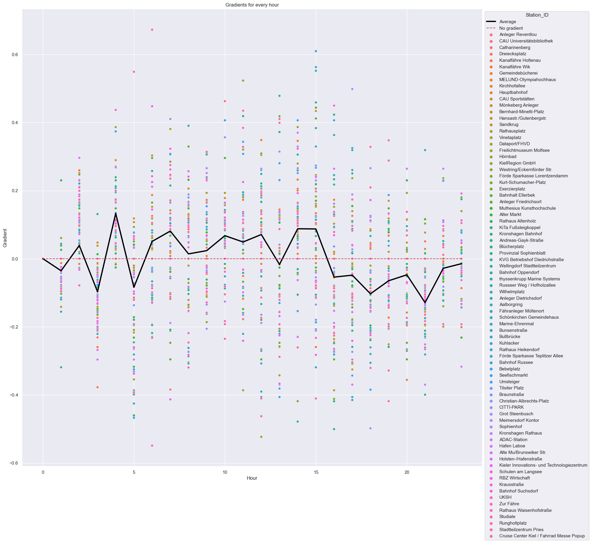

### Outlier Detection and Visualization

Let's take a look at all the attributes calculated so far and try to detect "unusual" renting behaviour by comparing each attribute to the overall average behaviour of every station.
The attributes look like the following:

```
  Station_ID  Hour  Used Bikes  Used Bikes Scaled Global Minima Global Maxima Gradient
0 Average     0     0.173578    0.294756          NaN           NaN           0.000000
1 Average     1     0.164411    0.259264          NaN           NaN           -0.035492
2 Average     2     0.174451    0.298136          NaN           NaN           0.038872
3 Average     3     0.149425    0.201237          0.201237      NaN           -0.096899
4 Average     4     0.183763    0.334192          NaN           NaN           0.132955
```

We say a station is an outlier for a given hour, if one of the following conditions is met:

- The usage of bikes at this station differs strongly to the usage at the average station (both scaled with amplitude scaling).
- The gradient at this hour differs strongly to the gradient of the average plot.
- The global minimum of this plot lies in the other half of the day than the average global minimum.
- The global maximum of this plot lies in the other half of the day than the average global maximum.

This yields the following stations as outliers as their rental behaviour at a given hour shows a differnt pattern than the average:

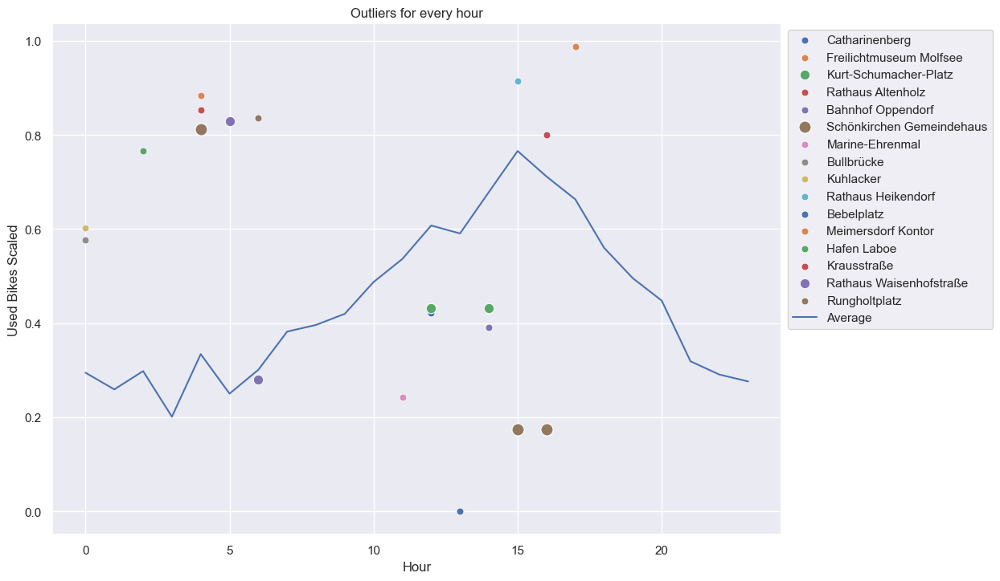

In this categorization the central station is an outlier not even for a single hour of the day. Yes, it is being used by far the most but the pattern of daily usage corresponds to the pattern of the overall average station.

## Do stations have similar patterns?

The question we asked ourselves is, if there are stations that have similar patterns. Is it possible to group different stations?
To answer that question, we need attributes to compare the stations with each other. The calculations can be found in the jupyter notebook [clustering_sf_attributes_per_day.ipynb](clustering_sf_attributes_per_day.ipynb).

### Attributes of the stations

We will compare the stations with different attributes. The attributes are: The frequency of usage of a station, the average number of bikes that are available at a station, the average usage of a station, the average renting and returning of a bike from/to a station.
These attributes can be collected with the function of the python file [get_informations_sprottenflotte.py](https://git.informatik.uni-kiel.de/stu217750/data-science-projekt/-/blob/main/get_information_sprottenflotte.py). To compare the stations we take the averages of a day of these attributes.

### The data

From the [get_informations_sprottenflotte.py](https://git.informatik.uni-kiel.de/stu217750/data-science-projekt/-/blob/main/get_information_sprottenflotte.py) we get a dataframe with the information that we need to compare the stations. The outcome of the dataframe is as follows:

```
  Station_ID  Frequency_of_Usage    Avg_Number_of_Bikes   Avg_Usage_of_Station    Avg_Returning_Bike_of_Station   Avg_Renting_Bike_of_Station   name                        lat       lon
0 24371       0.147733              26.559788             39.500000               24.833333                       25.500000                     Anleger Reventlou           54.333833 10.152250
2 24384       0.072000              1.164032              17.833333               8.333333                        8.333333                      CAU Universitätsbibliothek  54.346612 10.112408
4 24468       0.003733              0.383114              2.000000                0.166667                        0.500000                      Catharinenberg              54.264403 10.065600
5 24385       0.147200              2.526689              39.666667               19.500000                       19.000000                     Dreiecksplatz               54.328528 10.134417
...
```

### Clustering

First we want to cluster the stations and see if there are some patterns for the stations.

#### Preproccesing the dataframe

For the clustering task we need to optimize the dataframe. The name of a station and the station ID are not important for the clustering, also the location of a station should not influence the outcome. All these columns are dropped and the following dataframe is what the clustering algorithm was used on:

```
  Frequency_of_Usage  Avg_Number_of_Bikes   Avg_Usage_of_Station    Avg_Returning_Bike_of_Station   Avg_Renting_Bike_of_Station
1 0.153118            26.125970             42.875000               27.000000                       27.437500
2 0.074409            1.859372              21.937500               10.875000                       10.812500
4 0.001505            0.143668              1.375000                0.062500                        0.187500
5 0.140430            3.055982              39.562500               18.750000                       18.500000
```

In addition to extracting the columns, the station Kiel Hauptbahnhof is not being taken into consideration. This station can be seen as an outlier, because the usage is so high. For that reason we did not want to manipulate the clustering with the station. For reference the station will be plotted with the name Kiel Hauptbahnhof.

#### Finding the optimal number of clusters

To get the optimal number of clusters, we use the sum of squared errors. We generate up to 10 clusters and read the optimal number of clusters from the "elbow" function:

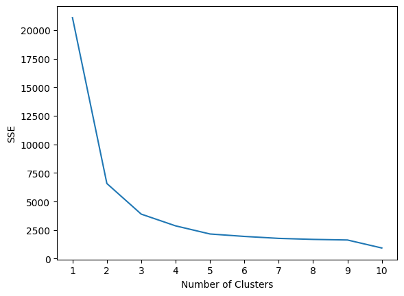

As seen from the plot, the optimum number of clusters is 3. So now we can cluster the stations with 3 clusters.

#### k-means clustering

For the clustering algorithm we used k-means.
The first visualization considers the most compelling attributes: Frequency of usage and renting/returning of bikes. This yields in a 3D plot:

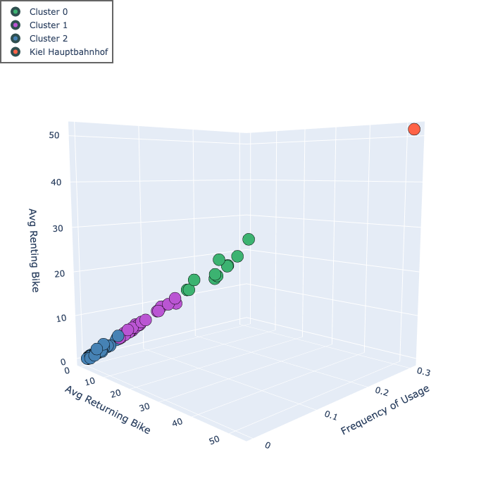

In this plot it is already visible why we did not cluster with the station Kiel Hauptbahnhof. The station has more usage in general and would have influenced the clusters.

#### PCA

Because we have more than 2 attributes we will perform a PCA to reduce the dimension and visualize the results in a 2D plot.

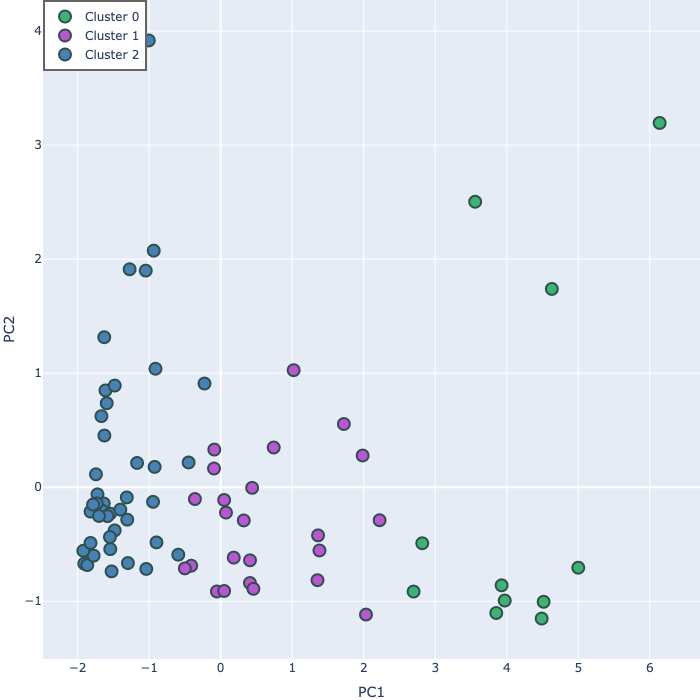.

As seen from the above plots we were able to cluster the stations based on the chosen attributes. The stations were divided in 3 clusters based on the usage of the respective station. Now that we know that the different stations have in some way a similar usage, we can ask ourselves, where these locations are located in Kiel.

### Location of stations

For that we plot the stations with the clusters on the map.

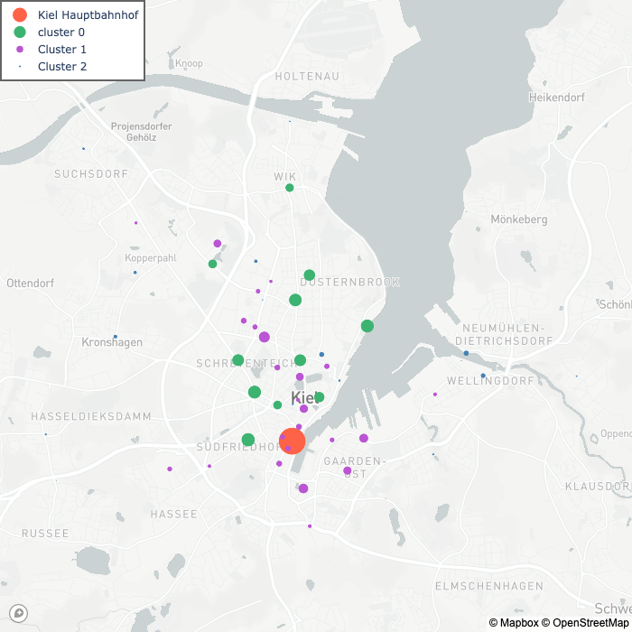

The stations with larger circles have a higher frequency of usage. As expected, the stations with a higher usage are located in the center of Kiel and the stations around Kiel are less frequently used. Also it appears, that the stations near the station Kiel Hauptbahnhof are not commonly used.

## Most common routes

With the gained information from the clustering, we want to know if it is possible to see patterns between stations and common routes taken. The jupyter notebook [most_common_routes.ipynb](https://git.informatik.uni-kiel.de/stu217750/data-science-projekt/-/blob/main/most_common_routes.ipynb) was used for this.

### What stations should be used?

With the information of the clustering, we know that there are some stations that are frequently used and some stations that are barely used. For that reason we will only use the stations that are commonly used. Those are the stations in cluster 0 and the station Kiel Hauptbahnhof.

### Getting the most common routes

#### Preparing the data

First we load the csv-file that we get from the [sprottenflotte_data.py](https://git.informatik.uni-kiel.de/stu217750/data-science-projekt/-/blob/main/scripts_data_collection/sprottenflotte_data.py) script. That is all the data we have from the stations. This dataframe needs to be filtered by only stations in Kiel and then to be merged with the clustering result from the clustering task. Now every station has a cluster and the station Kiel Hauptbahnhof will be given the cluster 3. Afterwards we will only filter by cluster 0 and 3, so that we get the most commonly used stations. The last operation is to drop unnecessary attributes. This yields the following dataframe:

```
        Station_ID  Number_of_Bikes   last_update
      0 24371       23                1677802253
      1 24371       23                1677802529
      2 24371       23                1677802835
      3 24371       23                1677803141
      4 24371       23                1677803445
        ...         ...               ...
190686  24382       1                 1679243114
190687  24382       1                 1679243389
        ...         ...               ...
```

#### Get the routes

To get the most common routes between stations, we used the function [get_routes](https://git.informatik.uni-kiel.de/stu217750/data-science-projekt/-/blob/main/get_most_common_routes.py#L55).

The idea is to iterate through all stations and for every station, if at some timepoint a bike is rented, look at all the other stations in a timeframe of the next 30 minutes and check whether a bike is returned within that timeframe.

The outcome is a dictionary with stations as keys and the respective value is a list, with the timeframe in which bike was returned at a station.

#### Get most common routes

Now that we have a dictionary with all the routes taken, we want to know how often a route is taken. For that we use the function [get_most_common_routes_from_routes](https://git.informatik.uni-kiel.de/stu217750/data-science-projekt/-/blob/main/get_most_common_routes.py#L55). This returns us the following dataframe:

```
  start_station   end_station   weight    start_name          start_lat   start_lon   end_name                end_lat     end_lon
0 24371           24385         116       Anleger Reventlou   54.333833   10.152250   Dreiecksplatz           54.328528   10.134417
1 24371           24412         138       Anleger Reventlou   54.333833   10.152250   MELUND-Olympiahochhaus  54.355250   10.131611
2 24371           24376         149       Anleger Reventlou   54.333833   10.152250   Kirchhofallee           54.316194   10.120583
3 24371           24397         254       Anleger Reventlou   54.333833   10.152250   Hauptbahnhof            54.315972   10.132278
```

### Visualizing the routes

Now we are able to visualize the most common routes:

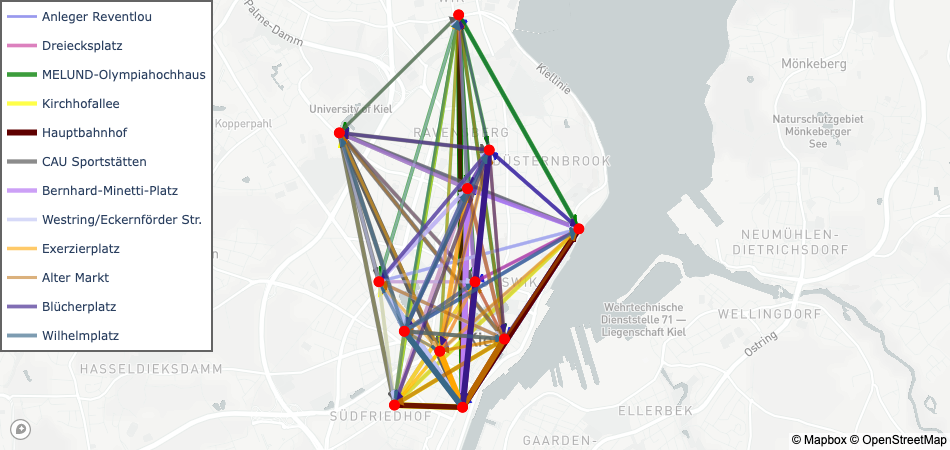

From this plot it is already visible, that the most common routes are directed to the station Kiel Hauptbahnhof. The following graph emphazises this as it shows the 2 most common routes taken from each station:

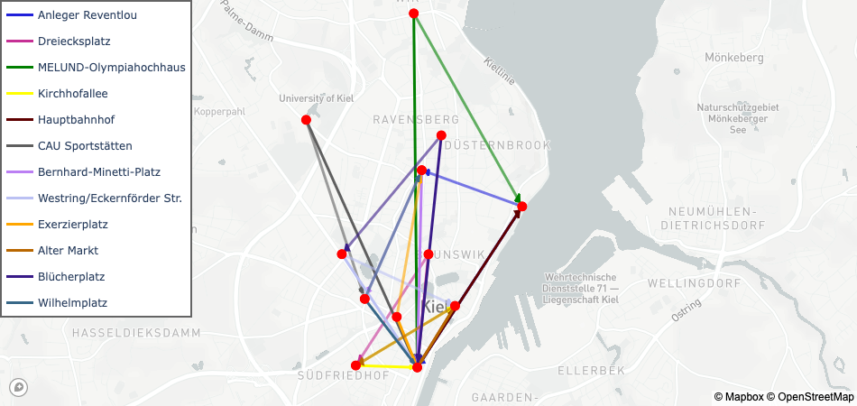

### Page Rank

With that in mind another questions arises. Can we rank the stations with respect to their importance? Is there a station that is most important?

For that we use the page rank algorithm. Because every station is connected to every other station, we need a weight to compare the different edges. We choose the frequency of a route taken as the weight. If a route has more frequent usage, the weight is higher. This results in a page rank visualized on the following map:

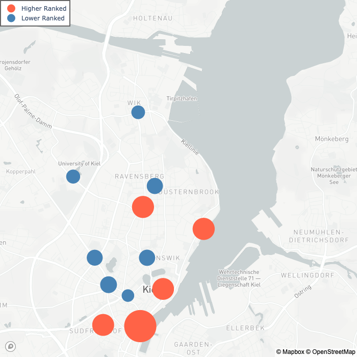

## Weather and Sprottenflotte

The last question we ask ourselves is, if the weather condition influences the usage of the Sprottenflotte bikes. And if this is the case: Can we predict the number of used bikes based on a weather predicition? `<br>`
The code to this part is in [sprotte_weather_together.ipynb](sprotte_weather_together.ipynb) while all the functions written and used for the code can be found at [weather_functions.py](weather_functions.py).

### Preprocessing weather data

<h4>Filter for interesting time slots</h4>

For using the weather data in context with the Sprottenflotte data we filter for the features 'timestamp', 'Precipitation', 'Condition', 'Sunshine', 'Temperature' and 'wind_speed'. This is because based on our own experience they have the most influence on the behaviour concerning the usage of a bike. `<br>`

Additionally we just keep the data of daytimes (6:00 - 22:00). The Sprottenflotte bikes are used so few during the night that the data would distort the results.`<br>`

After that we have a dataframe like this:

```
  timestamp                   Precipitation   Condition   Sunshine    Temperature   wind_speed
0 2023-03-03T06:00:00+00:00   0.0             fog         0.0         0.2           9.7
1 2023-03-03T06:30:00+00:00   0.0             fog         0.0         0.3           6.8
2 2023-03-03T07:00:00+00:00   0.0             fog         0.0         0.3           9.0
3 2023-03-03T07:30:00+00:00   0.0             fog         0.0         0.3           6.1
4 2023-03-03T08:00:00+00:00   0.0             fog         0.0         0.4           7.6
```

<h4>Transform categorical features</h4>

The feature 'Condition' of the weather data is a categorical attribute with the categories 'sleet', 'rain', 'snow', 'fog' and 'dry'. We convert the attribute by assigning every condition a number from 0 to 4. The higher the number the "nicer" the weather.

<h4>Clean the data</h4>

Normally the weather data is tracked every half hour. In our data it occurs at some points that half an hour is missing, a timestamp appears twice or a random timestamp appears. To remove the noisy data we drop duplicated or random timestamps (in between half hours). If half an hour is missing we copy the weather information of the timestamp before. The real data probably looks the same.
We are using the function [find_noise_in_timestamp](/weather_functions.py/#L47)

### Preprocessing Sprottenflotte data

<h4>Stations in Kiel</h4>

We are just interested in the data of Sprottenflotte in Kiel. We filter for the stations in Kiel with [get_station_of_kiel](/get_information_sprottenflotte.py#L318).

#### Filter for interesting time slots

The timestamp of the Sprottenflotte data is in UNIX time format. To filter for the daytime data, we convert the timestamp. After that we get a dataframe like this:

```
    Station_ID    Number_of_Bikes   Number_of_Docks_Available   is_installed    is_renting    is_returning    last_reported         last_update           Unnamed: 0    name              lat         lon         region_id   address   post_code
0   24371         25                76                          1               1             1               2023-03-03  05:39:08  2023-03-03 06:02:03   27            Anleger Reventlou 54.333833   10.15225    866         ,         NaN
1   24371         25                76                          1               1             1               2023-03-03  05:39:08  2023-03-03 06:07:08   27            Anleger Reventlou 54.333833   10.15225    866         ,         NaN
2   24371         25                76                          1               1             1               2023-03-03  05:39:08  2023-03-03 06:12:13   27            Anleger Reventlou 54.333833   10.15225    866         ,         NaN
3   24371         25                76                          1               1             1               2023-03-03  05:39:08  2023-03-03 06:17:18   27            Anleger Reventlou 54.333833   10.15225    866         ,         NaN
4   24371         25                76                          1               1             1               2023-03-03  05:39:08  2023-03-03 06:21:53   27            Anleger Reventlou 54.333833   10.15225    866         ,         NaN
```

#### Aggregate to half hours

In contrast to the weather data, the Sprottenflotte data is tracked every 5 minutes and it starts 2 minutes after the full hours. (It means we have the timestamps 06:02, 06:07, 06:12,...). To aggregate the timeslots up to half hours we use the functions: [avg_number_of_bike_per_half_hour](weather_functions.py#L138), [age_of_station_per_half_hour](weather_functions.py#L175), [returning_bike_of_station_per_half_hour](weather_functions.py#L213) and [renting_bike_of_station_per_half_hour](weather_functions.py#L251).

At the end we get four dictionaries for the attributes 'rented bikes', 'returned bikes', 'number of bikes', 'usage of bikes'. `<br>`
For each station they give the information of every half hour. We sum those up to have the numbers over all stations ([sum_up_funtion](weather_functions.py#L122)).

Notice: We ignore the fact that the half hour timestamps of the weather and the ones of the Sprottenflotte are now delayed for 2 minutes. But this shouldn't have a big impact on a weather condition.

### Weather and Sprottenflotte together

#### A first glance at the combined data

After the preprocessing we can combine the data of the weather and of the Sprottenflotte in a dataframe:

```
    timestamp                   Precipitation   Condition   Sunshine    Temperature   wind_speed  average use   number of bikes   rented bikes    returned bikes
0   2023-03-03T06:00:00+00:00   0.0             3           0.0         0.2           9.7         89            448.000000        7               3
1   2023-03-03T06:30:00+00:00   0.0             3           0.0         0.3           6.8         98            444.333333        12              13
2   2023-03-03T07:00:00+00:00   0.0             3           0.0         0.3           9.0         101           444.833333        12              12
3   2023-03-03T07:30:00+00:00   0.0             3           0.0         0.3           6.1         117           435.500000        23              21
4   2023-03-03T08:00:00+00:00   0.0             3           0.0         0.4           7.6         104           450.666667        12              23
```

To get a first impression of the potential existing correlation between weather attributes and Sprottenflotte attributes we observe the heatmap of correlations: `<br>`

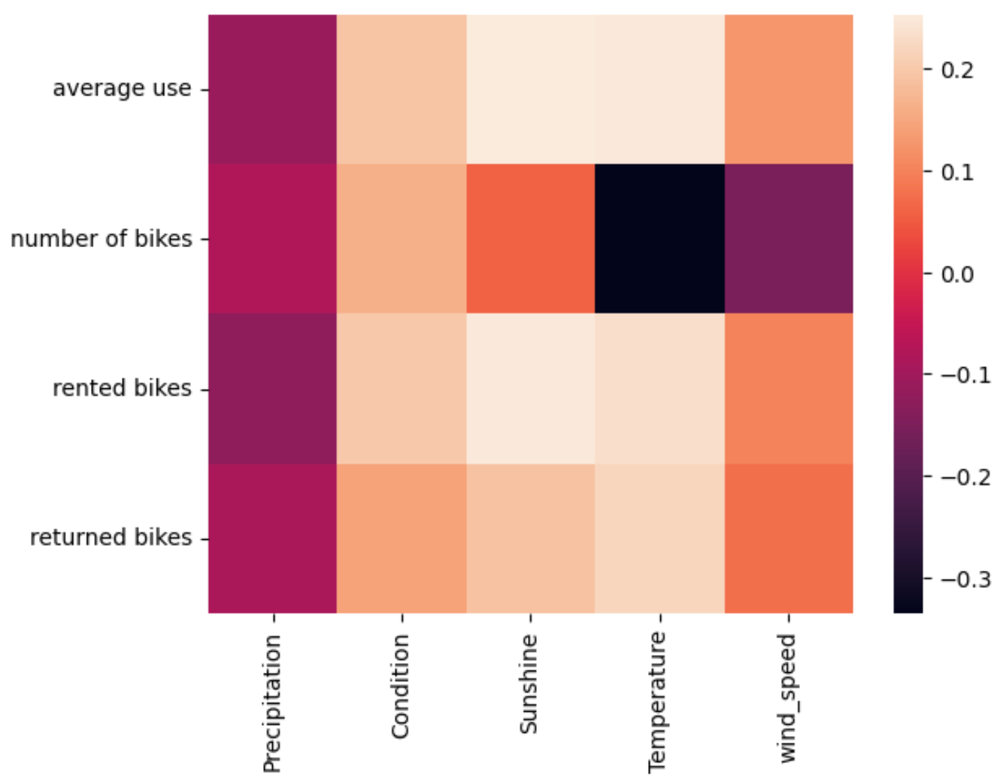 `<br>`

Notice: In the following we mostly regard the attribute 'rented bikes' as representant of the usage of the bikes. `<br>`
We can't observe any major correlation between the weather and the Sprottenflotte attributes. But this isn't a surprising result as our data collection time period was very short. Additionally we didn't have a lot of varying weather conditions (e.g. most of the time the 'Condition' attribute is 'dry').`<br>`
But nevertheless we can observe that the correlation is directed in the expected way (except the wind_speed).`<br>`
'Precipitation' is negatively correlated with the usage of the bikes, which means a higher number of precipitation (= worse weather) matches with a minor usage of bikes. Whereas a higher number of the other attributes, which are all positively correlated, symbolize good weather`<br>`
This leads to the conlusion that **the weather influces the usage behaviour of the Sprottenflotte**.

#### Clustering on the data

We are trying to do Clustering with the combined data to observe some common patterns. We do it `<br>`

a) with the full dimensioned data (5 weather attributes, and 4 Sprottenflotte attributes) `<br>`

b) with dimension reduction (PCA) on weather and Sprottenflotte before the clustering. `<br>`

The procedure is as follows (analogous to the clustering before):

1. Standardize the data.
2. Make an elbow function to conclude the number of clusters.
3. Using k-means algorithm on the `<br />`
   a) whole data-set `<br />`
   b) on the first PC (principle component) of the weather and the first PC of the Sprottenflotte data.
4. Visualize the result: `<br />`
   a) by plotting every two attributes in a pairplot and colouring the cluster assignments. `<br />`
   b) by plotting the two PCs and coloring the cluster assignments.

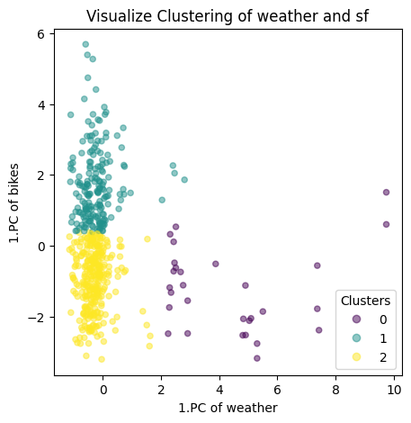.

We can't gain a lot of knowledge from this clustering but this can also be justified by the (in this context) small number of instances.

### Predictions

#### Predictions over all stations

At last we try to do predictions of the usage based on weather conditions using machine learning algorithms. `<br>`
For all following predicitons we take all 5 weather attributes as input data and the attribute 'rented bikes' as target value. That means we predict the number of rented bikes over all stations in half an hour.`<br>`
We always split the data into a train and a test set to train the model.

##### Linear regression

The advantage of the linear regression is that we can predict a numerical output, like in this case the exact number of rented bikes in half an hour over all stations. If we do linear regression on our train set, the result of the test set is: `<br>`

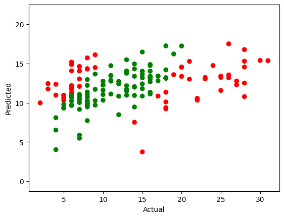

The algorithm doesn't work very well. We can see it in the picture as the red points are not well predicted data points. And the accuracy of the model - a quality measuring value - is very low with around 16 %.

##### Classification

As it is very hard to predict an exact number of rented bikes even if we would have more training data we are trying to predict classes of renting numbers. We create three classes ("low", "normal", "high") based on the distribution of the numbers of rented bikes. `<br>`

Then we try to predict the class of usage number based on the weather condition. We use `<br>`
a) Gaussian Naive Bayes `<br>`
b) Decision Tree `<br>`
c) Random Forest `<br>`

Comparing the quality measure values: accuracy, precision, recall and the confusion matrix, the Random Forest Classifier leads to the best results:

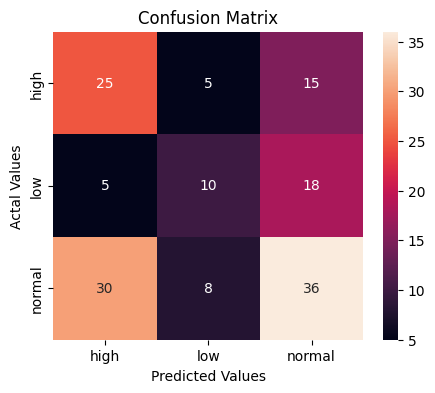

The results are still not highly significant but as the accuracy with 47% shows, it is much better than the linear regression. `<br>`
With the function [make_a_prediction_categories](weather_functions.py#L334) we break the weather condition attributes down into a couple of weather conditions to make a user friendly version of making a predicition.

#### Predictions for each station

At the end we make predictions for each stations. With [make_dataframe_of_weather_and_sf_per_station](weather_functions.py#L463) we can create a dataframe by using the dictonaries we obtained in [Aggregate to half hours](#aggregate-to-half-hours). But regarding those results you can notice that the numbers of rented bikes aren't very useful. Because the number of rented bikes at one stations in a timeslot of half an hour is very low and most of the times even 0. That's why we aggregate the values for a timeslot of 3 hours for the next section. [make_a_df_with_blocks_3_hours](weather_functions.py#L391) computes the mean for the values except for the rented bikes, where we need the sum. For the condition we take the rounded integer of the mean in order to picture the condition of the timeslot in the best way.
Then we try different prediction models again and compare the results. The best result comes from a poisson regressor, which works similiar to linear regression but is less sensible to small values close to zero (linear regression would predict negative values). With the function [make_predi_for_all_stations](weather_functions.py#L513) one can make a prediction of usage for a certain weather condition as input and gets a dicitionary with the predictions as values and the stations as key. Again we also have a more user friendly function [e_a_prediction_categories_stations](weather_functions.py#L524) to choose from a limited amount of weather conditions.

At the end we can plot the prediction for each stations. E.g. the example for good weather:

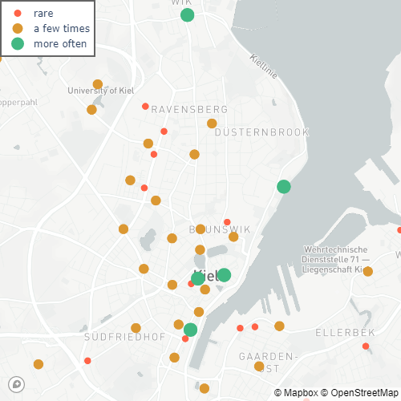

### Conlusions and Outlook

As we already mentioned the results aren't significant. But the analysis suggests that it is possible to make better predictions with more data (collected over a longer time period) and more input variables. It can be assumed that predictors like the weekdays or certain events in Kiel have great influce. In further analysis with the just mentioned bigger amount of data, it would be interesting to compare e.g. summer and winter times. Based on own experiences you would assume that the usage increments in summer months in general. And it would be interesting to see whether e.g. the stations near the beaches are used more frequently. All in all it could be possible to make predictions for the optimal distribution of bikes at the stations based on the input variables. One could also make suggestions where a station is irrelevant and at which position a new station would be beneficial.

## Web Application

We build our web application with React using several functional components to render the content.
The styling is done via CSS.
We use React Router to navigate between the different pages. <br />
Here is the link to our [website](https://coruscating-beignet-78b49f.netlify.app).
